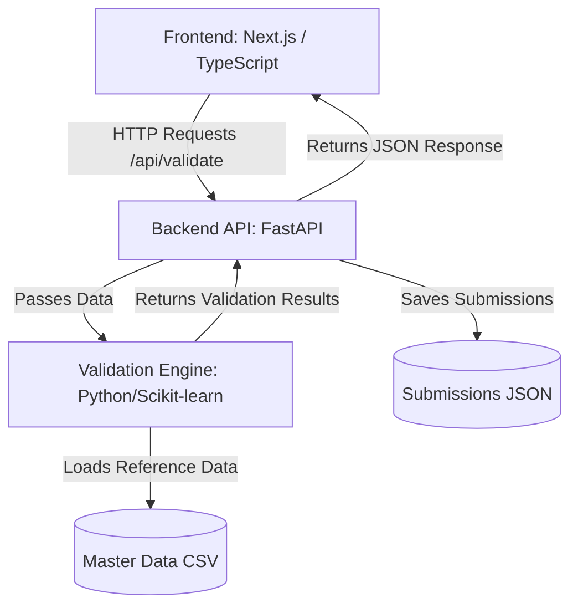

-----

# Product Data Validation System

A modernised, full-stack web application designed to improve the accuracy of product data entry.

This system replaces manual spot-checks with an intelligent, real-time validation engine. By using machine learning to compare new submissions against a trusted master dataset, it catches pricing errors, categorisation mistakes, and compliance issues (like missing age checks on alcohol) at the source.

-----

## 🔍 Key Features

### For Store Users (Data Entry)

  * **Real-Time Validation:** As users fill out the product form, the system immediately checks fields against backend logic.
  * **Intelligent Suggestions:** If a category or price looks incorrect based on similar existing products, the UI suggests the likely correct value.
  * **Graded Feedback System:**
      * ✅ **Pass:** Input is statistically sound.
      * ⚠️ **Warning:** Input looks unusual (e.g., price is 50% higher than average). The user must confirm before proceeding.
      * 🛑 **Hard Stop:** Critical error (e.g., price is £0, or alcohol is missing an age flag). Submission is blocked.
  * **Confirmation Workflow:** "Friction" is added to suspicious submissions, requiring users to review warnings and add notes for Head Office.

### For Head Office (Review)

  * **Dedicated Dashboard:** A view at `/ho-view` to manage incoming product requests.
  * **Workflow Management:** Separates "Pending" submissions that triggered warnings from auto-"Approved" ones.
  * **Decision Context:** HO staff can see exactly why a product was flagged and read notes from the store manager before approving or denying.

-----

## 🏗️ Architecture Overview

The application utilises a modern, decoupled client-server architecture:



### The Backend ("The Brain")

  * **Technology:** Python 3.10+, FastAPI.
  * **Core Logic (`validation_engine.py`):** Uses **TF-IDF (Term Frequency-Inverse Document Frequency)** and cosine similarity to convert product names into mathematical vectors. This allows it to find the "nearest neighbours" (most similar existing products) in the master dataset. It then uses the attributes of those neighbours to infer the correct category, likely price range, and necessary age flags for the new submission.

### The Frontend ("The Interface")

  * **Technology:** Next.js 14 (App Router), TypeScript, Tailwind CSS.
  * **Role:** Provides a responsive, type-safe user experience. It handles form state, displays real-time validation feedback efficiently, and communicates with the Python backend via API routes defined in `frontend/app/api`.

-----

## 🛠️ Tech Stack

| Component | Technology | Description |
| :--- | :--- | :--- |
| **Backend Language** | Python 3.10+ | Chosen for robust data science libraries. |
| **API Framework** | FastAPI | High-performance, easy-to-use web framework. |
| **Data Science** | Scikit-learn, Pandas | Used for TF-IDF vectorisation and data manipulation. |
| **Frontend Framework**| Next.js 14 | React framework for building the UI and handling internal API routing. |
| **Language** | TypeScript | Ensures type safety across the frontend components. |
| **Styling** | Tailwind CSS | Utility-first CSS framework for rapid UI development. |

-----

## 🚀 Getting Started

Follow these steps to run the project locally. You will need **two terminal windows** running simultaneously (one for the backend, one for the frontend).

### Prerequisites

  * Python 3.10 or higher
  * Node.js 18 or higher (LTS recommended)
  * Git

### 1\. Clone the Repository

```bash
git clone <your-repo-url>
cd <your-repo-folder>
```

### 2\. Set up the Backend (Terminal 1)

Navigate to the backend directory, create a virtual environment, install dependencies, and start the server.

```bash
# 1. Navigate to backend
cd backend

# 2. Create virtual environment
# Windows:
python -m venv venv
# macOS/Linux:
python3 -m venv venv

# 3. Activate virtual environment
# Windows:
.\venv\Scripts\activate
# macOS/Linux:
source venv/bin/activate

# 4. Install dependencies
pip install -r requirements.txt

# 5. Run the FastAPI server
# The server will start at http://localhost:8000
uvicorn app.main:app --reload --port 8000
```

### 3\. Set up the Frontend (Terminal 2)

Open a new terminal window. Navigate to the frontend directory, install Node dependencies, and start the development server.

```bash
# 1. Navigate to frontend
cd frontend

# 2. Install dependencies
npm install

# 3. Run the development server
# The frontend will start at http://localhost:3000
npm run dev
```

### 4\. Access the Application

  * **Store Submission Form:** Open [http://localhost:3000](https://www.google.com/search?q=http://localhost:3000) in your browser.
  * **Head Office Dashboard:** Open [http://localhost:3000/ho-view](https://www.google.com/search?q=http://localhost:3000/ho-view).

-----

## 📂 Project Structure

```
.
├── backend/
│   ├── app/
│   │   ├── main.py                # FastAPI entry point and API routes
│   │   ├── models.py              # Pydantic data models for API validation
│   │   └── validation_engine.py   # Core ML logic and TF-IDF implementation
│   ├── data/
│   │   ├── ho_products_dummy...csv# The "Master" reference dataset
│   │   └── submissions.json       # Simple file-based database for submissions
│   └── requirements.txt           # Python dependencies
│
└── frontend/
    ├── app/
    │   ├── api/                   # Next.js internal API routes (proxy to backend)
    │   ├── components/            # Reusable React components (Form, Modal, etc.)
    │   ├── ho-view/               # Head Office Dashboard page route
    │   └── page.tsx               # Main Store Submission form route
    ├── lib/                       # TypeScript definitions and utilities
    ├── public/                    # Static assets
    └── package.json               # Frontend dependencies
```
